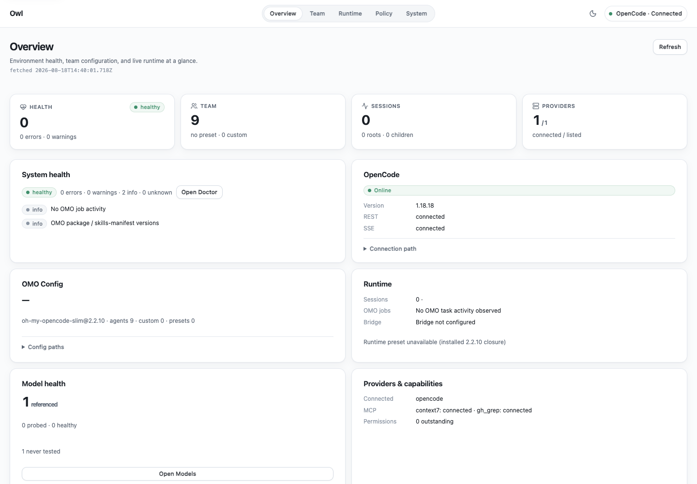
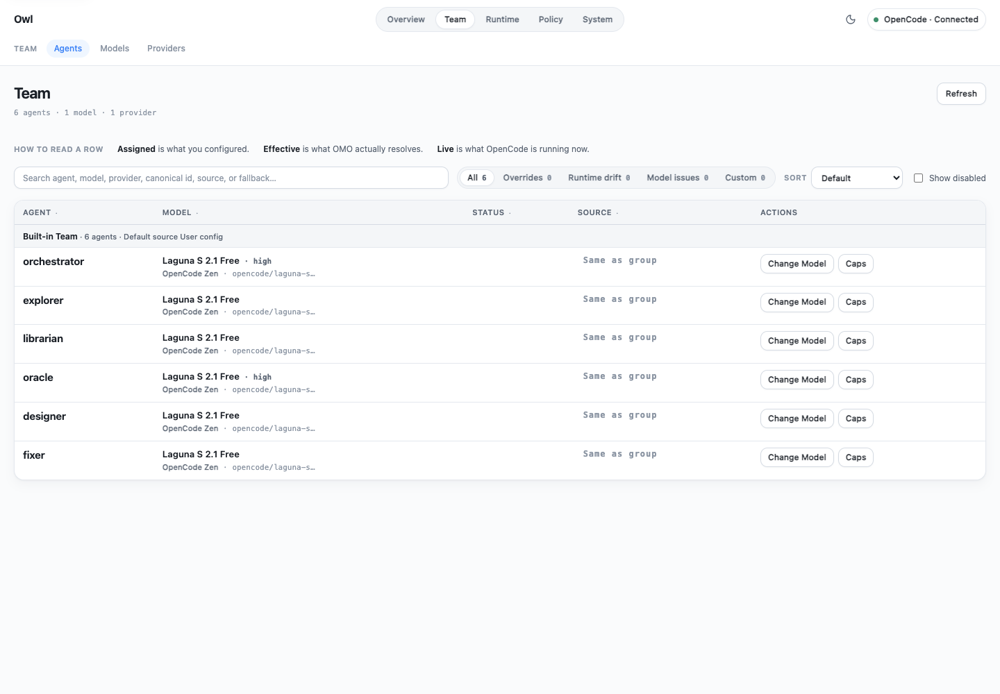
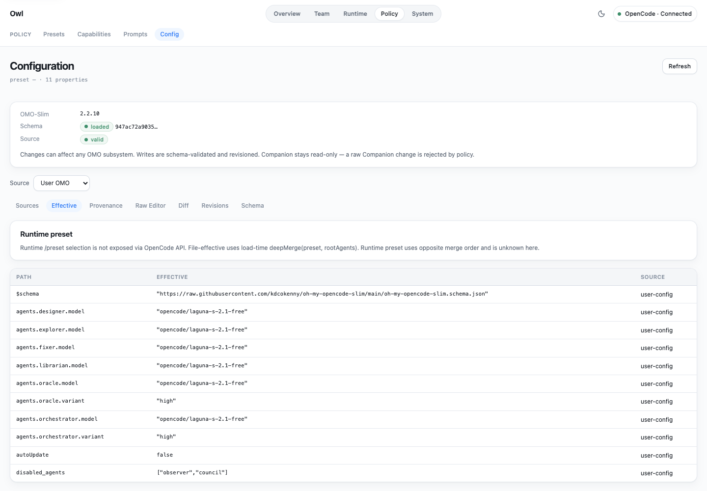
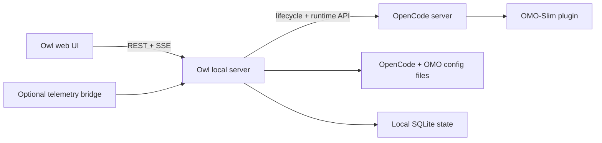

# Owl

**A local control plane for [OpenCode](https://opencode.ai/) and [Oh My OpenCode Slim](https://www.npmjs.com/package/oh-my-opencode-slim).**

[](LICENSE)


Owl gives you one place to configure your agent team, understand which settings win, and inspect what OpenCode is running. It is built for setups with multiple providers, specialist agents, fallback chains, presets, prompt files, permissions, background workers, and project overrides.

Owl organizes that state into three layers:

> **Desired → Effective → Live**
> What you configured → what OMO-Slim resolved → what OpenCode is actually running



> [!IMPORTANT]
> Owl is an early, opinionated, local engineering tool. It binds to loopback by default and is designed for a personal workstation or homelab, not an internet-facing multi-user service.

## Why Owl

- **Stop spelunking through JSONC.** Edit agents, model chains, presets, prompts, capabilities, and system settings through purpose-built screens.
- **See why a value won.** Follow settings back through defaults, presets, user config, project config, and root overrides.
- **Compare config with reality.** Put assigned, effective, and live model state next to each other instead of assuming they match.
- **Change configuration safely.** Preview schema-validated candidates, write atomically, retain JSONC structure, and restore earlier revisions.
- **Observe the runtime.** Inspect providers, models, sessions, specialist children, tool activity, background jobs, fallback behavior, and reusable workers.
- **Keep it local.** Owl reads your existing OpenCode and OMO-Slim setup directly and stores its own revision/probe data on the selected project.

## Product tour

### Your environment at a glance

Overview combines connection health, team state, sessions, providers, model health, OMO-Slim status, and the most important Doctor findings.


### The whole agent team

The Agents workspace shows each assignment, its source, and its health signals. When Assigned, Effective, and Live agree, the row stays compact; overrides and runtime drift expand into distinct states.



### Explainable configuration

Inspect effective values, provenance, schema state, raw JSONC, diffs, and revisions without losing access to the underlying files.



## What Owl offers

Owl groups day-to-day work into configuration, explainability, and runtime visibility.

### Configuration

- Built-in and custom agent assignments
- Primary models, ordered fallback chains, variants, and provider options
- User and project presets with comparisons and lifecycle actions
- Prompt replacement, append files, effective composition, and source inspection
- Skills, Model Context Protocol (MCP) servers, tools, permissions, and global availability controls
- Council coordinator and councillor preset management
- External ACP agent configuration and command/handshake probing
- Raw Monaco-based OpenCode and OMO-Slim configuration editing
- Installed OMO-Slim schema loading, validation, and coverage auditing

### Safety and explainability

- Desired, Effective, and Live state comparisons
- Field-level provenance and masked-override explanations
- Candidate simulation before writes
- JSONC-preserving, schema-validated atomic writes
- Local revision history and restore
- Rule-based Doctor diagnostics with evidence and deep links
- Explicit model probes with isolated sessions, timeouts, and stored results

### Runtime visibility

- Live OpenCode connection and provider/model inventory
- Server-Sent Events (SSE) instead of aggressive polling
- Session hierarchy with parent/child navigation
- Messages, tool activity, file changes, diffs, permissions, and token/context details
- OMO background jobs, specialist workers, session reuse, and fallback telemetry where available
- Terminal multiplexer detection and pane correlation
- Optional Owl telemetry bridge for OMO-Slim state that OpenCode does not expose directly

## What Owl is not

Owl is a control surface over OpenCode and OMO-Slim. It does not replace either runtime.

It is also not:

- hosted software as a service (SaaS);
- a multi-user control plane;
- a generic drag-and-drop agent workflow builder;
- a model-provider abstraction;
- a mobile app; or
- a reason to expose your OpenCode configuration service to the public internet.

## Get started

### Prerequisites

- [Bun](https://bun.sh/)
- A working OpenCode installation
- Oh My OpenCode Slim installed in the active OpenCode config directory
- `@opencode-ai/sdk@1.18.14` available under that config directory's `node_modules`

Owl currently targets the OpenCode SDK version above and loads the installed OMO-Slim schema at runtime. Your active OpenCode config directory must already exist.

### Clone and run

```bash
git clone https://github.com/schlambos/Owl.git
cd Owl
bun install
bun run dev
```

Open the [Owl UI](http://127.0.0.1:5173).

`bun run dev` starts the Owl API, web app, and Managed OpenCode lifecycle under one signal-aware supervisor:

- Owl UI: `http://127.0.0.1:5173`
- Owl API: `http://127.0.0.1:8787`
- Preferred Managed OpenCode address: `http://127.0.0.1:4096`

With no project override, Owl manages its own checkout because the official launch scripts start the server there. To manage another project:

```bash
OMO_CP_PROJECT_DIR=/absolute/path/to/your_project bun run dev
```

For a non-default OpenCode config directory:

```bash
OPENCODE_CONFIG_DIR=/absolute/path/to/opencode-config \
OMO_CP_PROJECT_DIR=/absolute/path/to/your_project \
bun run dev
```

Both paths must already exist and must be absolute. Owl fails closed on blank, relative, missing, or non-directory roots.

## Desktop apps

Owl ships as a signed-installer-free desktop app (Tauri shell + bundled Bun sidecar) from the **Desktop release** workflow. Releases are created as **drafts** and published by a maintainer.

Download the installer for your platform from the release page:

| Platform | Files | Notes |
| --- | --- | --- |
| macOS (Apple Silicon) | `Owl_<version>_aarch64.dmg` (drag to Applications) or `Owl_aarch64.app.zip` | Built on macos-14 |
| Windows (x64) | `Owl_<version>_x64-setup.exe` | NSIS installer |
| Linux (x64) | `Owl_<version>_amd64.deb` or `Owl_<version>_amd64.AppImage` | Debian/Ubuntu-family deb; AppImage is distribution-portable |

Every release asset has a matching SHA256 entry in `SHA256SUMS.txt` — verify before installing:

```bash
shasum -a 256 -c SHA256SUMS.txt --ignore-missing
```

### First launch

Owl auto-detects its environment — **no folder-selection dialogs ever appear**.

Your **OpenCode config directory** is resolved in this order:

1. an inherited, non-empty `OPENCODE_CONFIG_DIR` pointing at an existing directory;
2. `$XDG_CONFIG_HOME/opencode` when `XDG_CONFIG_HOME` is non-empty;
3. `~/.config/opencode` (macOS/Windows/Linux alike).

The conventional default is created if missing instead of asking.

The **project directory** is resolved in this order:

1. an inherited, non-empty `OMO_CP_PROJECT_DIR` pointing at an existing directory;
2. a launch argument that is an existing directory (including folders dropped onto the app);
3. an already-running OpenCode at `127.0.0.1:4096` (its live `/path` project);
4. the current working directory when it is a real workspace (contains `.git`, `.opencode`, or `package.json`);
5. your home directory as the last resort.

Detected paths are validated and persisted (small JSON under the app's config directory); subsequent launches reuse them. Delete that settings file to re-detect from scratch.

The desktop app then starts its bundled sidecar on an ephemeral loopback port and loads the Owl UI from that exact origin. Closing the window shuts the sidecar down gracefully (authenticated loopback shutdown, then a bounded hard stop). OpenCode and OMO-Slim prerequisites apply exactly as with the source run: a working OpenCode install, Oh My OpenCode Slim installed in the selected config directory, and `@opencode-ai/sdk@1.18.14` under that config directory's `node_modules`.

> [!WARNING]
> The macOS and Windows installers are **unsigned**. On macOS, allow the app via **System Settings → Privacy & Security** (or remove quarantine with `xattr -dr com.apple.quarantine /Applications/Owl.app`). On Windows, click **More info → Run anyway** on the SmartScreen prompt.

Linux builds are produced on Ubuntu 22.04 (glibc 2.35+) but the AppImage carries its own runtime payload; the deb targets Debian/Ubuntu-family systems.

## Managed and Attach modes

Owl has two explicit OpenCode lifecycle modes.

| Mode | Selection | Behavior |
| --- | --- | --- |
| **Managed** | `OPENCODE_BASE_URL` is unset | Reuses a compatible server on `127.0.0.1:4096` or starts one through the installed SDK. Owl owns only the process it starts and shuts it down cleanly. |
| **Attach** | `OPENCODE_BASE_URL=http://host:port` | Connects to an existing OpenCode server. Owl never starts, stops, replaces, or claims ownership of it. |

Attach to an existing server:

```bash
OPENCODE_BASE_URL=http://127.0.0.1:4096 bun run dev
```

To use the OpenCode terminal user interface (TUI) against Owl's Managed runtime, read the canonical `baseUrl` from `GET /api/opencode/lifecycle`, then run:

```bash
opencode attach http://127.0.0.1:4096
```

Running plain `opencode` starts a separate embedded runtime; it will not share Owl's Managed sessions.

## Configuration

| Variable | Default | Purpose |
| --- | --- | --- |
| `OMO_CP_PROJECT_DIR` | Server startup directory | Absolute target project containing project-local OMO configuration and Owl state. |
| `OPENCODE_CONFIG_DIR` | `$HOME/.config/opencode` | Active OpenCode config, installed SDK, OMO-Slim package, and user configuration. |
| `OPENCODE_BASE_URL` | Unset | Selects Attach mode when present. |
| `OMO_CP_HOST` | `127.0.0.1` | Owl API bind host. Keep this on loopback unless you understand the security implications. |
| `OMO_CP_PORT` | `8787` | Owl API port. |
| `OMO_BRIDGE_BASE_URL` | Unset | Optional validated loopback override for an externally managed OMO telemetry bridge. |

Owl works with the normal configuration locations:

```text
$OPENCODE_CONFIG_DIR/opencode.json
$OPENCODE_CONFIG_DIR/oh-my-opencode-slim.jsonc
$OPENCODE_CONFIG_DIR/oh-my-opencode-slim/*.md
/path/to/project/.opencode/oh-my-opencode-slim.jsonc
/path/to/project/.opencode/oh-my-opencode-slim/*.md
```

Its local SQLite state is stored under the selected target project:

```text
/path/to/project/data/control-plane.db
/path/to/project/data/control-plane-bridge.db
```

These databases hold Owl revision history, model probe results, and bridge management state. OpenCode and OMO-Slim configuration files remain authoritative.

## Local security model

Owl is powerful because it can read and update local configuration. Its filesystem scope is deliberately narrow.

At startup, Owl resolves exactly three authorized roots:

1. the Owl install directory;
2. the selected target project; and
3. the active OpenCode config directory.

The roots are absolute, canonicalized, and deduplicated. Browser requests cannot supply arbitrary filesystem roots. Project writes remain constrained to project configuration targets, while user writes remain constrained to the OpenCode config directory.

Other safety properties include:

- loopback network defaults;
- schema validation before authoritative OMO writes;
- temporary-file and reread validation before atomic rename;
- secret redaction in API errors and diagnostics;
- isolated, explicit-only model probes; and
- no automatic execution of arbitrary project ACP commands during discovery.

## How it works



The repository is a Bun workspace:

```text
apps/web                      React 19 + TypeScript + Vite
apps/server                   Bun HTTP server + SQLite + JSONC tooling
packages/shared               Shared REST/SSE contracts
packages/omo-telemetry-bridge Optional OpenCode plugin
src-tauri                     Desktop shell (Tauri 2, Rust)
```

The browser never edits configuration files directly. All parsing, resolution, validation, write transactions, backups, runtime communication, and filesystem checks live in the local server.

## Development

```bash
# Unified development supervisor
bun run dev

# Run each side separately
bun run dev:server
bun run dev:web

# Validation
bun run typecheck
bun run build
bun test
bun run audit:omo-schema
```

For desktop work (requires a Rust toolchain):

```bash
bun run desktop:prepare   # build SPA resources + compile the host sidecar
bun run desktop:smoke     # sidecar desktop-mode smoke test
bun run desktop:dev       # tauri dev
bun run desktop:build     # tauri build (platform bundles)
bun run desktop:verify    # verify bundle layout after desktop:build
```

The deeper implementation notes live in [`docs/architecture`](docs/architecture/README.md). [`PLAN.md`](PLAN.md) records the complete product direction and design constraints.

## Project status

Owl is at `0.1.1` and is being released as a working early-stage project. The main configuration, safety, diagnostics, model, agent, runtime, Council, ACP, and system-management surfaces are implemented, but OpenCode and OMO-Slim continue to evolve.

Owl prefers an honest `unknown` or `unavailable` state over inventing runtime data that the installed versions do not expose. Expect version-specific limitations around some OMO-Slim runtime details.

Issues and pull requests are welcome. For larger changes, please keep the local-first model, strict filesystem boundaries, and Desired → Effective → Live distinction intact.

## License

Licensed under the [Apache License 2.0](LICENSE).
